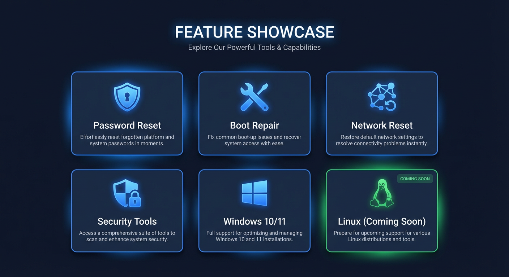

# 6 fonctionnalites phares de WinRescue

---

## 1. Votre telephone devient un outil de reparation professionnel

**Fini les cles USB oubliees au bureau.**

WinRescue transforme le smartphone que vous portez deja sur vous en clavier USB physique capable de reparer un PC Windows. Branche par cable, le telephone est reconnu instantanement par le PC comme un vrai clavier -- meme quand Windows refuse de demarrer. Un seul cable OTG (moins de 5 EUR) remplace tout un kit de depannage.

---

## 2. 22 scripts couvrent les urgences les plus frequentes

**Un probleme ? Il y a un script pour ca.**

Reset de mot de passe, reparation du demarrage, suppression de malware, reinitialisation usine, activation du bureau a distance... WinRescue embarque 22 scripts de recuperation couvrant 5 categories : Recuperation, Administration, Reparation, Securite et Reseau. Windows 10 et Windows 11 sont pris en charge avec des scripts dedies a chaque version.

---

## 3. Un wizard interactif qui vous prend par la main

**Plus besoin de memoriser les commandes.**

Chaque script est decompose en etapes simples avec une instruction claire, une explication technique pour les curieux, et une question de confirmation avant de passer a la suite. Les etapes critiques sont verrouillees : impossible de continuer tant que l'action precedente n'est pas validee. En cas d'echec, une instruction alternative vous guide vers la solution.

---

## 4. Zero faute de frappe, meme sur les commandes les plus longues

**Le telephone tape a votre place, caractere par caractere.**

`takeown /f C:\Windows\ServiceProfiles\LocalService\AppData\Local\Microsoft\NGC /r /d y`

Essayez de taper ca sans erreur dans une invite de commandes, sur un clavier inconnu, sous pression. WinRescue envoie chaque caractere avec un delai calibre de 30 a 50 ms, sans inversion de `/` et `\`, sans coquille, sans oubli. Les variables (nom d'utilisateur, mot de passe) sont injectees automatiquement dans les commandes.

---

## 5. Compatible Secure Boot, sans modifier le BIOS

**Aucune cle USB bootable necessaire.**

Contrairement aux outils classiques (Hiren's Boot, Windows PE, Kon-Boot), WinRescue n'a pas besoin de demarrer depuis un support externe. Il utilise l'environnement de recuperation deja integre a Windows (WinRE). Le telephone agit comme un clavier, pas comme un disque de demarrage. Resultat : ca fonctionne avec Secure Boot active, sans toucher au BIOS, sur toutes les marques de PC.

---

## 6. Support multi-layout : QWERTY et AZERTY sans souci

**Les bonnes touches, au bon endroit.**

Un clavier AZERTY n'envoie pas les memes codes qu'un QWERTY. WinRescue gere nativement les deux dispositions avec un systeme de scan codes physiques. Le layout AZERTY prend en charge les inversions de touches (A/Q, Z/W), les symboles AltGr et la rangee des chiffres avec Shift. Un simple reglage dans les parametres suffit pour basculer.
