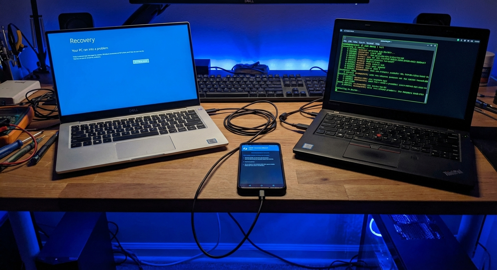
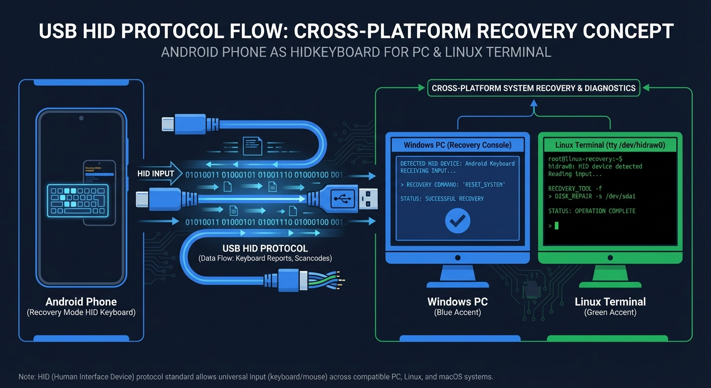

# Landing page -- Copy WinRescue

> Ce document contient les textes prets a integrer dans une landing page. Chaque section est delimitee et annotee.

---

## Hero

### Headline

**Votre telephone repare Windows.**

### Subheadline

WinRescue transforme votre smartphone Android en clavier USB de recuperation. Branchez-le a un PC en panne, choisissez un script, suivez le guide : les commandes de reparation sont envoyees automatiquement.

### CTA principal

**Telecharger WinRescue** (gratuit, APK Android)

### CTA secondaire

Voir comment ca marche

---

## Section Probleme

### Titre

**Un PC bloque. Pas d'outil sous la main. Ca vous parle ?**

### Contenu

Mot de passe oublie. Ecran bleu au demarrage. Malware qui prend le controle. Ces situations arrivent au pire moment : quand la cle USB bootable est restee au bureau, quand le technicien ne peut pas se deplacer, quand il faut que ca remarche *maintenant*.

Les solutions traditionnelles demandent toutes la meme chose :

- **Une cle USB bootable** preparee a l'avance, avec le bon ISO, a jour
- **Un support d'installation Windows** : 5 Go a telecharger, un outil de flashage, du temps
- **Un technicien** qui vient avec son kit -- demain, peut-etre

Et dans tous les cas, il faut savoir taper les bonnes commandes dans une invite noire, sans se tromper.

---

## Section Solution

### Titre

**Un smartphone. Un cable. C'est tout.**

### Contenu

WinRescue fait de votre telephone Android un clavier USB physique. Branche par cable au PC, le telephone est reconnu instantanement -- meme quand Windows ne demarre pas.

Pas de cle USB a preparer. Pas de BIOS a modifier. Pas de commandes a memoriser.

L'application vous guide etape par etape avec un wizard interactif. A chaque etape, une instruction claire vous dit quoi faire. Les commandes sont tapees automatiquement par le telephone, caractere par caractere, sans erreur.

**22 scripts de recuperation** couvrent les situations d'urgence les plus courantes : reset de mot de passe, reparation du demarrage, suppression de malware, reinitialisation usine, et bien plus.

---

## Section Features (cards)

### Card 1 : Clavier USB instantane

Branchez, c'est pret. Le PC reconnait le telephone comme un vrai clavier, meme depuis l'ecran de recuperation ou le BIOS.

### Card 2 : 22 scripts de recuperation

De la reinitialisation de mot de passe a la reparation du demarrage, en passant par la suppression de malware. Windows 10 et 11 couverts.

### Card 3 : Wizard pas a pas

Chaque script est decompose en etapes simples. Instructions claires, confirmations a chaque etape, options de reessai en cas de probleme.

### Card 4 : Zero erreur de frappe

Les commandes les plus complexes sont tapees automatiquement avec un timing calibre. Plus d'inversion de `/` et `\`, plus de faute dans les noms de fichiers systeme.

### Card 5 : Compatible Secure Boot

Pas besoin de modifier le BIOS ni de desactiver Secure Boot. WinRescue utilise l'environnement de recuperation natif de Windows.

### Card 6 : QWERTY et AZERTY

Le telephone s'adapte a la disposition clavier du PC cible. Un reglage suffit pour basculer entre les deux layouts.

---

## Section "Comment ca marche" (3 etapes)

### Titre

**Reparez un PC en 3 etapes**

### Etape 1 : Brancher

Reliez votre telephone au PC par cable USB-C/OTG. Le PC reconnait un clavier.

### Etape 2 : Choisir

Selectionnez le script qui correspond a votre probleme. Renseignez les informations demandees (nom d'utilisateur, mot de passe...).

### Etape 3 : Suivre le guide

Le wizard vous accompagne etape par etape. Le telephone envoie les commandes automatiquement. Vous confirmez chaque etape.

---

## Section FAQ marketing

### WinRescue fonctionne-t-il sans internet ?

Oui. L'application fonctionne entierement hors ligne. Aucune connexion internet n'est necessaire, ni sur le telephone ni sur le PC.

### Mon telephone doit-il etre roote ?

Oui. Le root est necessaire pour que le telephone puisse se faire passer pour un clavier USB. Magisk et KernelSU sont supportes.

### Quels telephones sont compatibles ?

Les Google Pixel et OnePlus sont recommandes. Les Samsung, Xiaomi et Huawei presentent des incompatibilites materielles connues.

### Est-ce que ca marche avec Windows 10 et Windows 11 ?

Oui. WinRescue embarque des scripts dedies pour chaque version, avec les adaptations necessaires (methode d'acces a WinRE, gestion UEFI/EFI, etc.).

### WinRescue peut-il contourner BitLocker ?

Non. Le script de desactivation BitLocker necessite la cle de recuperation legitime (48 chiffres). WinRescue ne contourne aucun chiffrement.

### C'est legal ?

Oui, quand vous l'utilisez sur vos propres systemes ou des systemes pour lesquels vous avez l'autorisation. L'application affiche un disclaimer legal au premier lancement.

### Les donnees sont-elles collectees ?

Non. Aucune donnee n'est envoyee sur internet. Tout reste sur le telephone et le PC.

---

## Footer CTA

### Titre

**Pret a transformer votre telephone en outil de recuperation ?**

### Texte

Installez WinRescue et gardez un outil de depannage Windows dans votre poche. 22 scripts, un wizard interactif, zero materiel supplementaire.

### CTA

**Telecharger l'APK**

### Sous-CTA

[Lire la documentation](../public/index.md)
